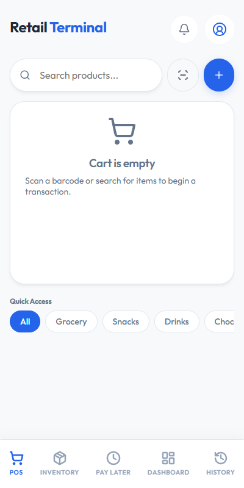
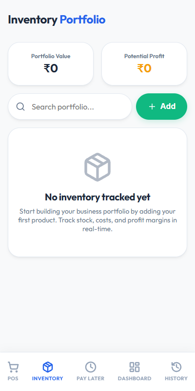
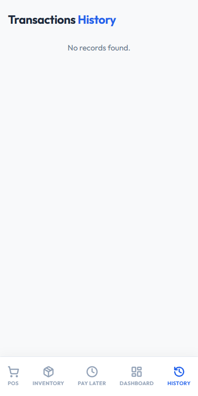
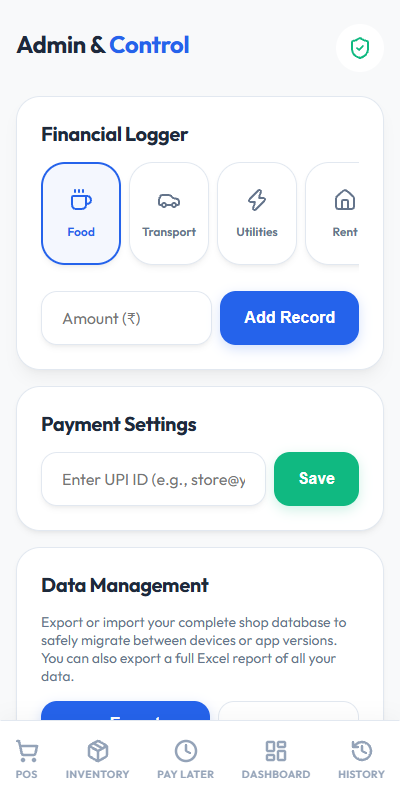

# Retail Terminal - Shop Billing Application

This report details all the features of the fully-offline, secure, and intuitive Shop Billing application built with React, Vite, and Capacitor.

## 1. Point of Sale (POS) & Billing

The POS screen is the heart of the application, designed for rapid checkout and seamless customer experiences.

### Key Capabilities:
- **Barcode Scanning:** Instantly add products to the cart using the device camera. If an unknown barcode is scanned, it seamlessly prompts the "Quick Add" modal.
- **Quick Add:** Add custom or new products on the fly directly from the POS screen, including assigning them to a category.
- **Category Browsing (Quick Access):** Click on any category bubble (like "Snacks" or "Drinks") to instantly filter and browse products in that category, replacing the cart view.
- **Dynamic Cart Management:** Increase/decrease quantities or remove items with a single tap.

### Checkout & Payments
- **Multiple Payment Methods:** Accept Cash, Pay Later (Credit), and UPI / Wallet.
- **Dynamic UPI QR Code:** Generates a strict UPI QR code locked to the exact cart total. Customers scan this with GPay or PhonePe to pay the precise amount directly to the shop owner's bank account.
- **WhatsApp Receipts:** After a successful transaction, instantly share a digital receipt with the customer via WhatsApp.

---

## 2. Inventory Management

A powerful portfolio view of all products stored locally.

### Key Capabilities:
- **Portfolio Analytics:** Automatically calculates Total Portfolio Value and Potential Profit based on the current stock, selling price, and cost price.
- **Comprehensive Editing:** Update any aspect of a product at any time, including Product Name, Selling Price, Cost Price, Initial Stock, and Category.
- **Visual Stock Tracking:** Easily see which items are running low on stock. Stock automatically deducts when items are sold in the POS.

---

## 3. Transaction History

A unified chronological feed of all financial movements in the shop.

### Key Capabilities:
- **Chronological Feed:** View all Sales and Investments in one continuous timeline, sorted by the most recent transactions.
- **Detailed Insights:** See exactly what items were sold in each transaction, the payment method used, and the total amount.
- **Visual Indicators:** Green arrows indicate income (Sales), while red arrows indicate money spent (Investments).

---

## 4. Admin Control & Data Management

A secure, password-protected area for business operations.

### Key Capabilities:
- **Master Password:** Protected by a secure passcode (`admin123`) to prevent unauthorized access.
- **Financial Logger (Expenses):** Log daily shop expenses (Food, Transport, Rent, Salary, Utilities) to keep track of money going out.
- **Data Management (Backup & Restore):** 
  - **Export Backup (JSON):** Download the entire offline database (Products, Sales, Customers, Settings, Expenses) into a single secure file.
  - **Restore Backup:** Easily migrate to a new device or update the APK without losing data by restoring the backup file.
  - **Excel Export:** Generate a comprehensive Excel workbook detailing Sales, Inventory, Customers, and Investments for accounting purposes.

---

*Report generated automatically.*
